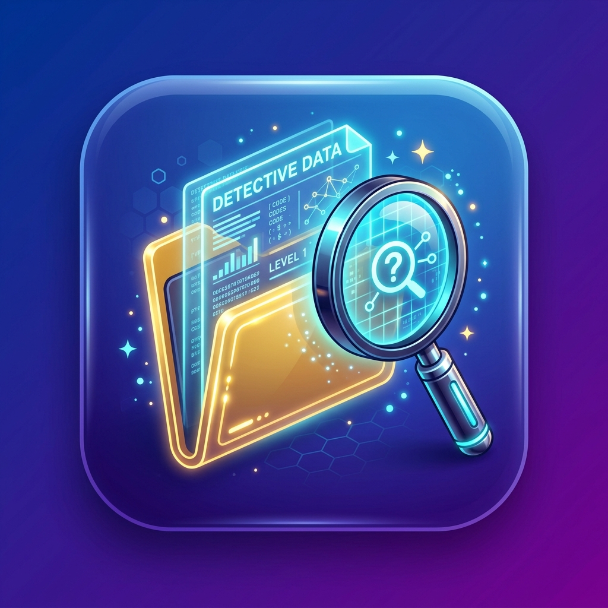

# 🕵️ Misi Detektif Digital: Petualangan Data 📁

Game Pembelajaran Interaktif Informatika Kelas 7 SMP — **Edisi Khusus 1-Klik Cepat**.  
Dirancang untuk mengenalkan konsep antarmuka pengguna (GUI), manajemen berkas, dan struktur folder melalui skenario cerita interaktif tanpa memerlukan kemampuan mengetik atau klik kanan yang rumit.



---

## 🎯 Fokus Materi 5 Operasi File & Folder
Game ini mengasah pemahaman siswa terhadap 5 operasi file mendasar pada sistem operasi:
1. **📄 Copy (Salin / Gandakan):** Menggandakan file ke tempat baru tanpa menghilangkan file asli.
2. **✂️ Cut (Pindah / Potong):** Memindahkan file dari tempat lama ke tempat baru secara utuh.
3. **📁 New Folder (Folder Baru):** Membuat wadah map baru untuk mengelompokkan dan merapikan file.
4. **📝 Rename (Ganti Nama):** Mengubah judul atau nama file/folder tanpa merusak isinya.
5. **🗑️ Delete (Hapus):** Menyingkirkan file rusak, berbahaya, atau tidak terpakai ke Recycle Bin.

---

## ✨ Fitur Unggulan

- **🎮 Kontrol 1-Klik Cepat:** Tombol pilihan jawaban berukuran jumbo (A, B, C, D) dengan ikon visual yang jelas.
- **📚 50 Bank Soal Skenario Praktis:** Masing-masing 10 soal untuk 5 operasi file (Copy, Cut, New Folder, Rename, Delete).
- **🎲 Pengacakan Urutan Soal (Random):** Menggunakan algoritma Fisher-Yates shuffle sehingga urutan soal selalu acak dan segar di setiap sesi permainan.
- **🛡️ Bebas Bocoran:** Soal dan ilustrasi tidak membocorkan jawaban agar siswa berpikir kritis.
- **⏱️ Pengaturan Waktu Fleksibel:**
  - Preset Cepat: 1 Menit, 2 Menit, 3 Menit, 5 Menit, atau Mode Santai.
  - **Custom Waktu:** Bebas mengatur menit dan detik sesuai kebutuhan kelas.
- **📊 Peringkat & Riwayat Skor:** Menampilkan skor, persentase akurasi, kombo jawaban, dan gelar detektif.
- **📲 Dukungan PWA & Offline:** Dapat diinstal ke laptop atau HP dan dimainkan 100% tanpa internet.

---

## 🚀 Cara Menjalankan Game

1. **Buka Langsung:**
   Cukup klik dua kali berkas [`index.html`](index.html) pada peramban web (Google Chrome, Microsoft Edge, Firefox, dll.).
2. **Menggunakan Web Server Lokal:**
   ```bash
   python -m http.server 8080
   ```
   Lalu buka `http://localhost:8080` di browser.

---

## 💻 Lisensi & Pembuat
Dikembangkan sebagai media pembelajaran interaktif Informatika tingkat SMP.
